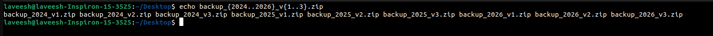

# Experminent 2
View the gedit man page.
Use the man -k ext4 command to find the command to tune
ext4 file-system parameters.
Brace expansion is used to generate discretionary strings of
characters. Braces contain a comma-separated list of strings,or a sequence expression. The result includes the text that
precedes or follows the brace definition.

---

## Approach

### 1) Viewing the manual page for 'gedit'
The `man` command is used to access the manual page for a specific command.

#### Syntax
```bash
man gedit
```

#### Screenshot


---

### 2) Searching for commands related to 'ext4'
The `man -k` command searches for commands associated with a specific keyword.

#### Syntax
```bash
man -k ext4
```

#### Screenshot


---

### 3) Using brace expansions
Brace expansion is used to generate strings efficiently.

#### Example 1: Creating a List of Strings.
```bash
echo file_{A,B,C}.txt
```

#### Screenshot


---

#### Example 2: Creating a List of Numbers
```bash
echo number_{1..5}
```

#### Screenshot


---

#### Example 3: Combining text with brace expansion
```bash
echo backup_{2024..2026}_v{1..3}.zip
```

#### Screenshot

