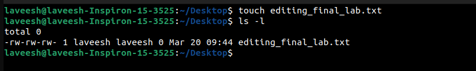
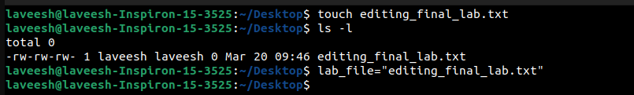
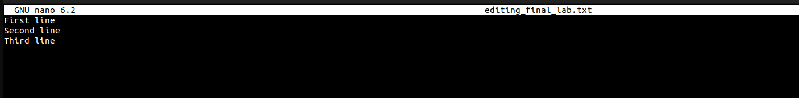

# Experiment 3
This lab focuses on editing files in Linux using two popular text editors: Nano and Vim. The tasks include creating a file, editing it using both editors, and performing specific text manipulation tasks in Vim.

---

## Approach

### Preparing the lab file
Ensure the file editing_final_lab.txt exists. If not, create it using:
```bash
touch editing_final_lab.txt
```

### Screenshot



To simplify file access, store its path in a shell variable:
```bash
lab_file="editing_final_lab.txt"
```

### Screenshot


---

### 2. Editing with Nano
Nano is a beginner-friendly text editor.

#### Steps:
1. Open the file in Nano:
   ```bash
   nano $lab_file
   ```
   #### Screenshot
   
2. Add the following lines:
   ```
   First line
   Second line
   Third line
   ```
   #### Screenshot
   
3. Save the changes (`CTRL + O`) and exit (`CTRL + X`).

---

### 3. Editing with Vim
Vim is a powerful text editor with advanced features.

#### Steps:
1. Open the file in Vim:
   ```bash
   vim $lab_file
   ```
   #### Screenshot
   
3. **Delete the Last Seven Characters of the First Line**:
   - Enter visual mode (`v`), highlight the last seven characters, and press `d`.
4. **Keep Only the First Four Characters of the First Line**:
   - Move to the start of the line, press `4l`, enter visual mode (`v`), highlight the rest, and press `d`.
5. Save and exit:
   - Press `ESC`, type `:wq`, and press `Enter`.

---

## Verifying Command Execution
To confirm the changes, display the file's contents:
```bash
cat $lab_file
```

#### Screenshot:


### Expected Output:
If the file initially contained:
```
This is the first line of file
This is the second line of file
Thsi is the third line of file
```

After editing with Vim, the first line should appear as:
```
This
```

#### Screenshot


---

## Conclusion
In this lab, you learned how to:
- Use **Nano** for basic file editing.
- Use **Vim** for advanced text manipulation, including deleting specific characters and retaining selected portions of text.

These skills are essential for efficient file editing and Linux scripting.
