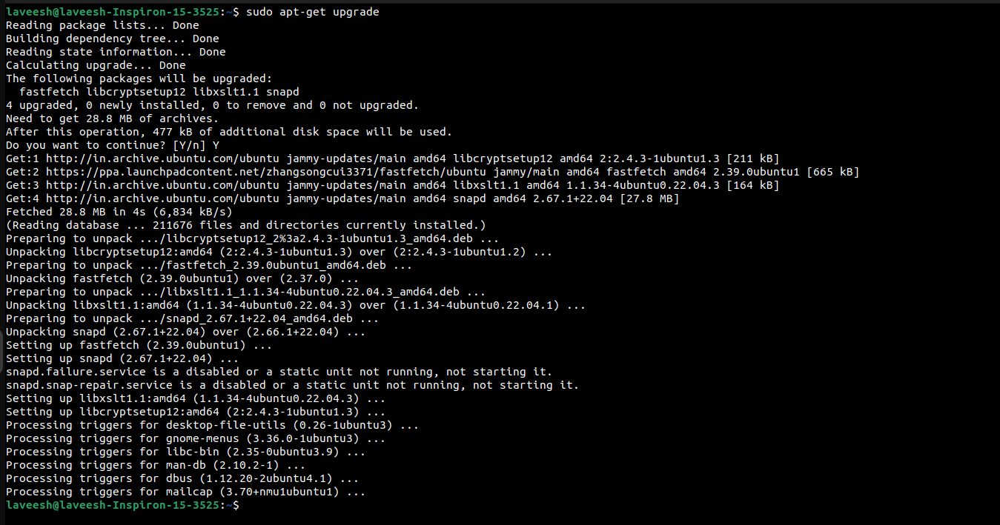

# Experiment 5

Implement ps, top, kill command with their options.
Installing, updating, and removing software by apt-get
command.

---

## Approach

### 1. Process Management

#### a. Viewing Processes with `ps`
The `ps` command displays details about active processes.

##### Commands:
1. View processes for the current user:
   ```bash
   ps
   ```
   #### Screenshot
   
   
3. View all processes:
   ```bash
   ps -e
   ```
   #### Screenshot
   
   
5. View processes in detailed format:
   ```bash
   ps -ef
   ```
   #### Screenshot
   
   

---


#### b. Monitoring Processes with `top`
The `top` command provides a real-time view of system processes.

##### Command:
```bash
top
```

#### Screenshot:


---


#### c. Terminating Processes with `kill`
The `kill` command is used to terminate processes by their PID.

##### Commands:
1. End a process by PID:
   ```bash
   kill <PID>
   ```
   #### Screenshot
   
   
3. Forcefully terminate a process:
   ```bash
   kill -9 <PID>
   ```
   #### Screenshot
   
   

---


### 2. Software Management with `apt-get`

#### a. Installing Software
The `apt-get install` command is used to install software packages.

##### Command:
```bash
sudo apt-get install htop
```

#### Screenshot:


---


#### b. Updating Software
To refresh the package list and upgrade installed packages:

##### Commands:
1. Update the package list:
   ```bash
   sudo apt-get update
   ```
   #### Screenshot
   
   
3. Upgrade installed packages:
   ```bash
   sudo apt-get upgrade
   ```
   #### Screenshot
   
   
   
---


#### c. Removing Software
The `apt-get remove` command is used to uninstall software, and `apt-get purge` removes it along with configuration files.

##### Commands:
1. Remove a package:
   ```bash
   sudo apt-get remove htop
   ```
   #### Screenshot
   
   
3. Purge a package:
   ```bash
   sudo apt-get purge htop
   ```
   
   

---


### 3. Verifying Software Installation and Removal
The `dpkg` command is used to check if a package is installed.

##### Command:
```bash
dpkg -l | grep htop
```

#### Screenshot:


---


## Conclusion
In this lab, you practiced:
1. Managing processes using `ps`, `top`, and `kill`.
2. Installing, updating, and removing software using `apt-get`.

These skills are essential for effective system administration, process monitoring, and software management in Linux environments.
