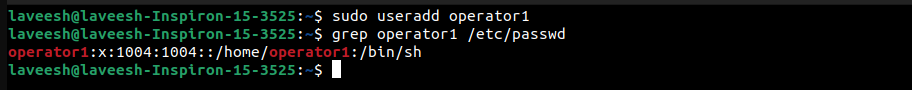
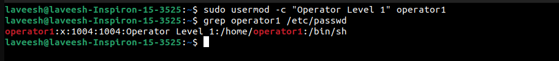
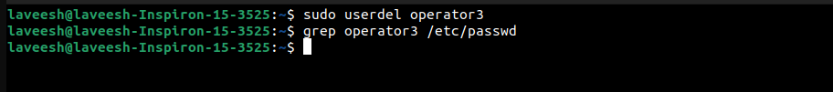

# Experiment 6
Create the operator1 user and confirm that it exists in the
system. Set the password for operator1. Create the
additional operator2 and operator3 users. Set their
passwords as well. Run the usermod -c command to update
the comments of the operator1 user account. Remove
the operator3 user from the system.

---


## Approach

### 1. Creating User Accounts
The `useradd` command is used to create new user accounts.

#### Commands:
1. Create a user:
   ```bash
   sudo useradd operator1
   ```
2. Verify user creation:
   ```bash
   grep operator1 /etc/passwd
   ```

#### Screenshot:



---


### 2. Setting and Changing Passwords
The `passwd` command is used to assign or update passwords for user accounts.

#### Commands:
1. Set a password for a user:
   ```bash
   sudo passwd operator1
   ```

#### Screenshot:


---


### 3. Modifying User Accounts
The `usermod` command is used to update user account settings.

#### Commands:
1. Add a comment for a user:
   ```bash
   sudo usermod -c "Operator Level 1" operator1
   ```
2. Verify updated user information:
   ```bash
   grep operator1 /etc/passwd
   ```

#### Screenshot:



---


### 4. Removing User Accounts
The `userdel` command is used to delete user accounts.

#### Commands:
1. Remove a user:
   ```bash
   sudo userdel operator3
   ```
2. Verify user removal:
   ```bash
   grep operator3 /etc/passwd
   ```

#### Screenshot:



---


### 5. Additional User Management Commands
1. View all users in the system:
   ```bash
   cat /etc/passwd
   ```
2. Create a user with a home directory:
   ```bash
   sudo useradd -m username
   ```
3. Create a user with a specific shell:
   ```bash
   sudo useradd -s /bin/bash username
   ```
4. Lock and unlock user accounts:
   ```bash
   # Lock a user account
   sudo passwd -l username

   # Unlock a user account
   sudo passwd -u username
   ```

---

## Conclusion
In this lab, you practiced:
1. Adding new user accounts using `useradd`.
2. Setting and updating passwords with `passwd`.
3. Modifying user details using `usermod`.
4. Deleting user accounts using `userdel`.

These commands are essential for managing users and performing system administration tasks in Linux environments.
